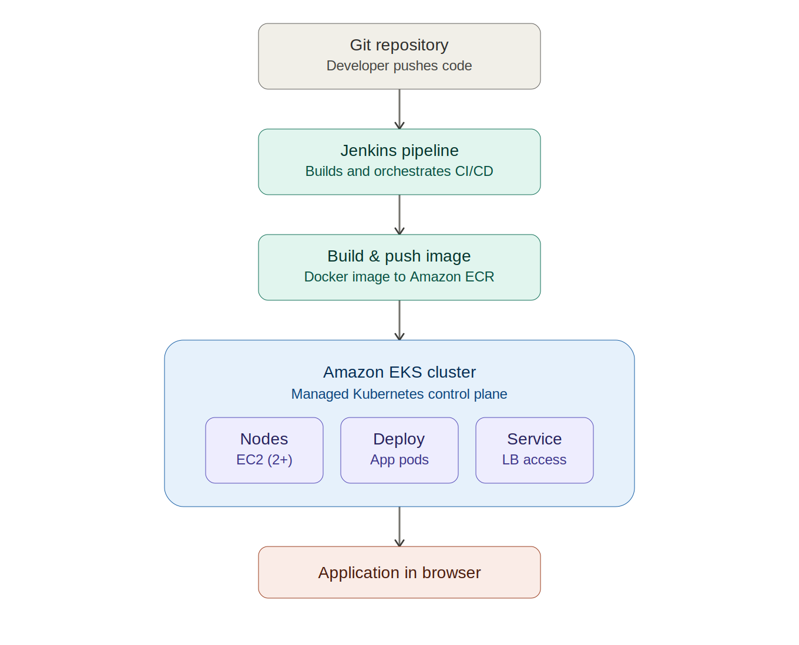

<div align="center">

# React Vite Application — CI/CD to Amazon EKS with Jenkins

**A fully automated CI/CD pipeline that builds, containerizes, and deploys a React (Vite) application to Amazon EKS — from `git push` to production, with zero manual intervention.**



</div>

---

## Table of contents

- [Overview](#overview)
- [Architecture](#architecture)
- [Tech stack](#tech-stack)
- [Repository structure](#repository-structure)
- [Pipeline workflow](#pipeline-workflow)
- [Infrastructure setup](#infrastructure-setup)
  - [1. Amazon EKS cluster](#1-amazon-eks-cluster)
  - [2. Jenkins server](#2-jenkins-server)
  - [3. Jenkins configuration](#3-jenkins-configuration)
  - [4. Credentials](#4-credentials)
  - [5. IAM ↔ Kubernetes RBAC](#5-iam--kubernetes-rbac)
- [Application](#application)
- [Docker](#docker)
- [Kubernetes manifests](#kubernetes-manifests)
- [Jenkins pipeline](#jenkins-pipeline)
- [Continuous deployment](#continuous-deployment)
- [Issues encountered and fixes](#issues-encountered-and-fixes)
- [Screenshots](#screenshots)
- [Result](#result)
- [Author](#author)

---

## Overview

This project implements an end-to-end CI/CD pipeline for a frontend application, covering the full path from source control to a running Kubernetes workload:

```
Developer → Git push → Jenkins → Docker build → Amazon ECR → Amazon EKS → Live application
```

Every commit pushed to `main` is automatically picked up by Jenkins, built, containerized, pushed to a registry, and rolled out to the cluster — no manual steps, no manual redeploys.

## Architecture

The diagram at the top of this README shows the full flow:

1. A developer pushes code to this GitHub repository.
2. Jenkins (running on an EC2 instance) detects the change and triggers the pipeline.
3. The pipeline installs dependencies, builds the Vite application, and builds a Docker image.
4. The image is pushed to Amazon ECR with a unique tag per build.
5. Jenkins updates the Kubernetes Deployment on Amazon EKS with the new image and waits for the rollout to complete.
6. The application is served to end users through a Kubernetes Service backed by an AWS LoadBalancer.

## Tech stack

| Layer | Tool |
|---|---|
| Frontend | React + Vite |
| CI/CD | Jenkins (Declarative Pipeline) |
| Containerization | Docker |
| Web server (runtime) | Nginx |
| Container registry | Amazon ECR |
| Orchestration | Amazon EKS (Kubernetes) |
| Cloud infrastructure | AWS EC2, IAM, VPC |
| Version control | Git / GitHub |

## Repository structure

```
.
├── aws/                     # AWS CLI / cluster provisioning artifacts
├── k8s/                     # Kubernetes manifests
│   ├── deployment.yaml
│   └── service.yaml
├── public/                  # Static assets
├── screenshots/             # Setup and pipeline evidence (Jenkins, AWS console, K8s)
│   └── architecture-diagram.png
├── src/                     # React application source
├── .dockerignore
├── .gitignore
├── Dockerfile                # Multi-stage build: Node (build) → Nginx (serve)
├── Jenkinsfile                # Pipeline definition
├── cluster.yaml              # EKS cluster spec (eksctl)
├── package.json
└── README.md
```

## Pipeline workflow

```
Checkout SCM → Install Dependencies → Build React App
   → Build Docker Image → Push to ECR → Update K8s Deployment → Verify Rollout
```

Each stage must succeed before the next begins. Images are tagged with the Jenkins `BUILD_NUMBER`, so every deployment can be traced back to the exact pipeline run that produced it. The final stage runs `kubectl set image` followed by `kubectl rollout status`, so the pipeline only reports success once the new pods are actually healthy and serving traffic — not just once the deployment object is updated.

## Infrastructure setup

### 1. Amazon EKS cluster

- Cluster provisioned with one control plane and a managed node group of 2+ worker nodes (see `cluster.yaml`).
- Connectivity verified from both a local machine and the Jenkins EC2 instance:
  ```bash
  aws eks update-kubeconfig --region <region> --name <cluster-name>
  kubectl get nodes
  ```

### 2. Jenkins server

Hosted on an EC2 instance with the following installed:
- Java, Git, Docker, AWS CLI, kubectl
- Jenkins itself, configured to start automatically as a service

The `jenkins` system user was added to the `docker` group so pipeline builds can invoke Docker without elevated privileges:
```bash
sudo usermod -aG docker jenkins
sudo systemctl restart jenkins
```

### 3. Jenkins configuration

- Recommended plugins installed, plus the **NodeJS Plugin** and **AWS Credentials Plugin**
- Global Tool Configuration: Git (auto-detected) and a NodeJS installation matching the app's requirements
- Administrator account created

### 4. Credentials

Configured under **Manage Jenkins → Credentials**:

| Credential | Kind | Purpose |
|---|---|---|
| `github-cred` | Username with password (GitHub PAT) | Repository checkout |
| `aws-cred` | AWS Credentials | ECR authentication, EKS access |

### 5. IAM ↔ Kubernetes RBAC

IAM permissions alone do not grant `kubectl` access — the IAM identity used by Jenkins must also be mapped into the cluster's `aws-auth` ConfigMap:

```bash
kubectl edit configmap aws-auth -n kube-system
```
```yaml
mapUsers: |
  - userarn: arn:aws:iam::<account-id>:user/<jenkins-iam-user>
    username: <jenkins-iam-user>
    groups:
      - system:masters
```

## Application

A standard Vite + React application (`npm create vite@latest`, React template). No backend — this project's focus is the delivery pipeline, not application logic.

```bash
npm install
npm run dev       # local development
npm run build      # production build
```

## Docker

Multi-stage build — a Node build stage compiles the Vite app, and the final image serves the static output through Nginx, keeping the runtime image small.

```bash
docker build -t jenkins-eks-react-app .
docker run -p 8080:80 jenkins-eks-react-app
```

## Kubernetes manifests

Located in `k8s/`:
- **`deployment.yaml`** — defines the application Deployment, replica count, and container image reference
- **`service.yaml`** — exposes the Deployment via a `LoadBalancer` type Service, provisioning an AWS ELB

Apply manually (Jenkins updates the running image automatically after the initial apply):
```bash
kubectl apply -f k8s/deployment.yaml
kubectl apply -f k8s/service.yaml
```

## Jenkins pipeline

Defined in [`Jenkinsfile`](./Jenkinsfile) at the repository root, configured in Jenkins as **Pipeline script from SCM**. On every run it:

1. Checks out this repository
2. Installs dependencies (`npm install`)
3. Builds the production bundle (`npm run build`)
4. Builds a Docker image tagged with the current `BUILD_NUMBER`
5. Authenticates to and pushes the image to Amazon ECR
6. Updates the EKS Deployment's image and confirms the rollout succeeds

## Continuous deployment

Jenkins polls this repository every 5 minutes:
```
H/5 * * * *
```
Any push to `main` triggers a full pipeline run automatically — build, push, and rollout — with no manual action required. This was verified end-to-end: a commit pushed to this repo produced a new build in Jenkins Build History without a manual "Build Now" click, and the updated application was confirmed live via the LoadBalancer URL.

## Issues encountered and fixes

| Issue | Cause | Fix |
|---|---|---|
| `node: error while loading shared libraries: libatomic.so.1` | Missing system library on a minimal Amazon Linux EC2 image | `sudo dnf install -y libatomic` |
| `permission denied` connecting to the Docker daemon | `jenkins` user not in the `docker` group | `sudo usermod -aG docker jenkins` + restart Jenkins |
| `kubectl` returned `Unauthorized` despite IAM `AdministratorAccess` | IAM permissions and Kubernetes RBAC are separate systems | Mapped the IAM user into the `aws-auth` ConfigMap under `mapUsers` |

## Screenshots

Setup and verification evidence — AWS console, Jenkins configuration, pipeline runs, and the deployed application — is available in [`screenshots/`](./screenshots).

## Result

A code change pushed to this repository is reflected on the live, EKS-hosted application within minutes, with no manual build or deployment steps.

## Author

**Pritam Priyanshu Patra**
Final-year ECE undergraduate, Silicon University, Bhubaneswar
[GitHub](https://github.com/PritamPriyanshuPatra2003) · [LinkedIn](https://linkedin.com/in/pritampriyanshupatra/)
